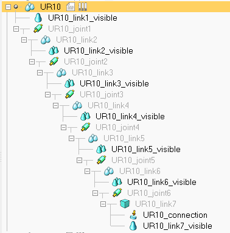
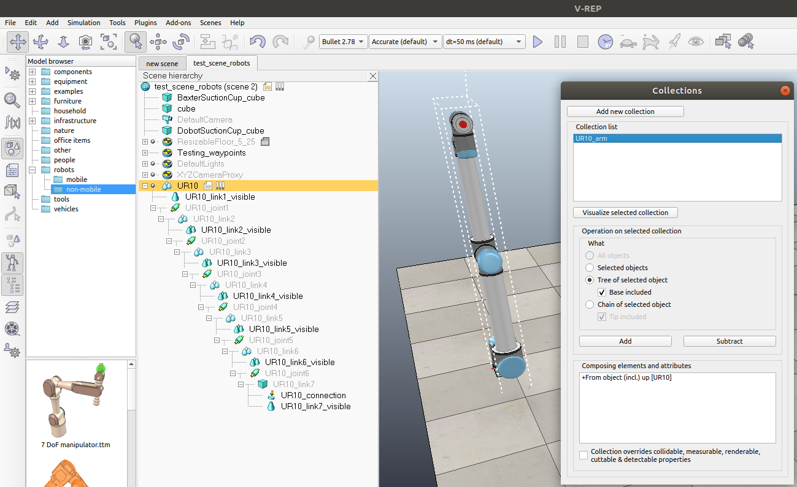
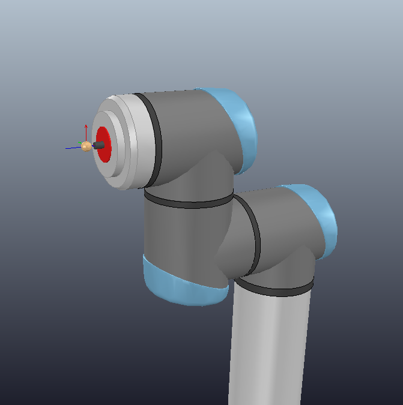
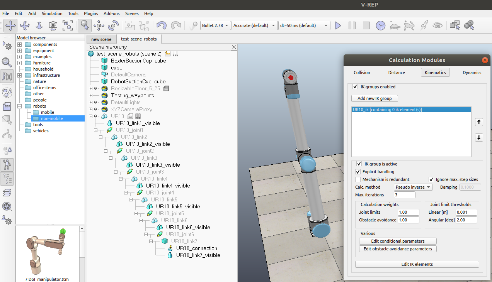
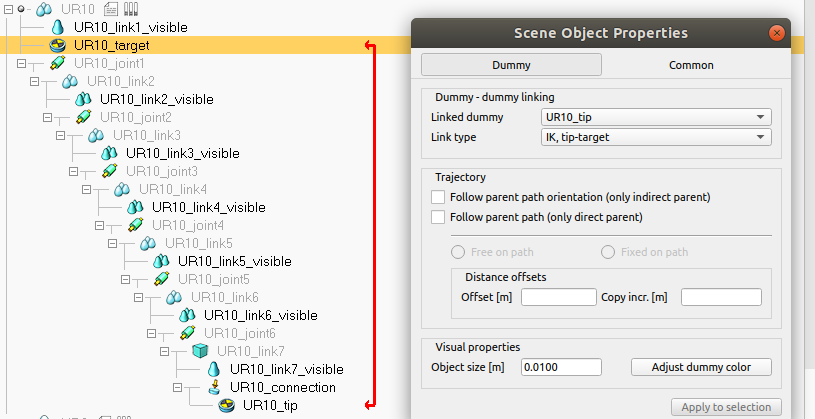

# Adding Robots

If the robot you want is not currently supported, then why not add it in!
Below is a quick tutorial on how to do this. The tutorial assumes some proficiency with CoppeliaSim.
You may want to take a look at the CoppeliaSim [tutorials](http://www.coppeliarobotics.com/helpFiles/en/tutorials.htm).

#### 1. CoppeliaSim documentation

First read through the '[building a clean model tutorial](http://www.coppeliarobotics.com/helpFiles/en/buildingAModelTutorial.htm)', 
which will show you how to first import CAD data (OBJ, STL, DXF), Collada, or 
URDF files, and then how to configure the dynamic shapes.

#### 2. Object naming

After step 1, you should now have your model in the CoppeliaSim scene. 
Ensure that all of your joints are in Torque/force mode and that both 
the motor and control loop is enabled. Also ensure that the robot root is a 'model'. 
Do this by double clicking the robot root in the scene hierarchy to open 
up the 'Scene Object Properties' dialog, navigate to the 'Common' tab, and 
check 'Object is model base'.

Make sure that each of the scene objects are named appropriately. For example, 
for the UR10 robot, we name the visual objects 'UR10_link1_visible', 'UR10_link2_visible', etc, 
and the joints 'UR10_joint1', 'UR10_joint2', etc.



#### 3. Adding child script

On the root node of the robot, create a 'Non-threaded child script'. 
**You do not need to modify the file**. This is needed to ensure that if the 
robot is cloned, then the object names in the clone behave as expected.

#### 4. Collision collections

Now we will make a collision collection. In the toolbar on the left, 
click to open the 'Collections' dialog. Click 'Add new collection' and a new item 
will appear in the 'Collections list'. Rename this (by double clicking on the item) 
to '\<Robot\>_arm' where '\<Robot\>'
is the name of the arm. For example, for the UR10, this would be 'UR10_arm'. In the scene hierarchy, 
click the root of the robot, and then in the 'Collections' dialog (making sure 
the correct item in the 'Collection list' is selected), click the 
'Tree of selected object' radio button, and then click 'Add'.




#### 5. Kinematics

##### Dummys

First create 2 Dummy objects, named '\<MYRobot\>_target' and '\<MYRobot\>_tip' (e.g. UR10_target and UR10_tip). 
In the scene hierarchy, the 'target' dummy should be a child of the robot root node, and the tip
dummy should be a child of the last node in the robot arm. 
Position both the dummies at the tip of the arm, and orient the tip dummy such 
that the z-axis points out from the arm. 



##### Kinematics group

Now we will add a kinematics group (needed for motion planning). In the toolbar on the left, 
click to open the 'Calculation Modules' dialog, and navigate to the 'Kinematics' tab. 
Click 'Add new IK group' and a new item will appear in the list. Rename this 
(by double clicking on item) to '\<Robot\>_ik' where '\<Robot\>'
is the name of the arm. For example, for the UR10, this would be 'UR10_ik'.
You should be able to leave the default values. Ensure that 'Explicit handling' is checked.



Before you leave this dialog, click on 'Edit IK elements', which will open a new dialog. 
In this dialog, select the '\<MYRobot\>_tip' from the dropdown and click 'Add new IK 
element with tip'. In the 'Base' dropdown that now becomes visible, select the base/root 
of your robot, for the UR10, this will be 'UR10'. Close this dialog.

Finally, double click on the 'target' dummy in the scene hierarchy and choose the 
'\<MYRobot\>_tip' option from the 'Linked dummy' dropdown, 
and choose the 'IK, tip-target' option from the 'Link type' dropdown.



##### Python Time

Now we are done with the CoppeliaSim side of things. If you have been 
keeping to the naming conventions, then there is very little code needed!

Navigate to `pyrep/arms/` and create a new python file called 'my_robot.py', e.g. 'ur10.py'.
Your file should look something like this:

```python
from pyrep.robots.arms.arm import Arm

class MyRobot(Arm):

    def __init__(self, count: int = 0):
        super().__init__(count, 'MyRobot', num_joints=6)

```

The string: 'MyRobot', should match exactly the prefix used in the previous steps of the tutorial, e.g. 'UR10'.

##### Tests and finishing up

Adding unit tests for the robot is easy! 

Open up the scene `tests/assets/test_scene_robots.ttt` and place your robot in there. This
scene file contains all of the robot arms that have been brought in to PyRep and is used for testing
that the robots have been created correctly.

Now simply navigate to `tests/test_arms_and_configuration_paths.py`,
and add your new robot to the list of `ARMS` (following the convention already in place).
Run the unit tests before submitting a pull request.

**Please do not submit pull request unless the robot is unit tested.**

If you get stuck at any point, take a look at some of the existing robots in PyRep.
If you are still stuck, the feel free to raise an issue and ask a question.
